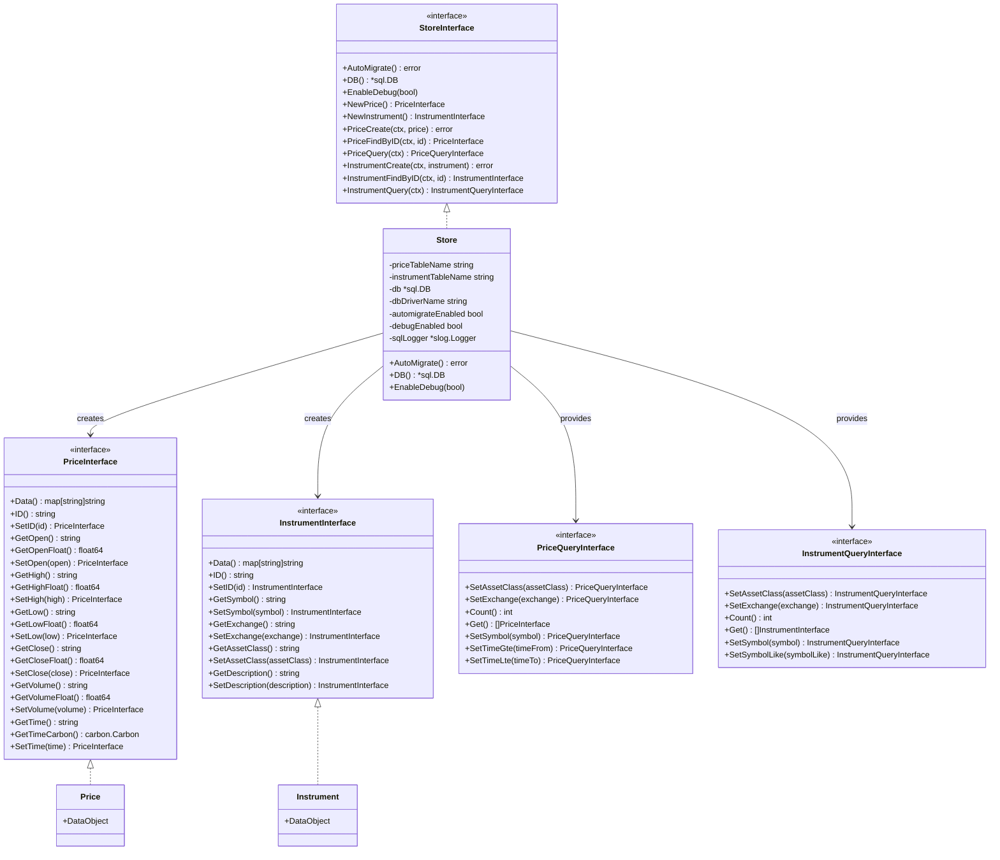

# Trading Store <a href="https://gitpod.io/#https://github.com/dracory/tradingstore" style="float:right:"></a>

[](https://github.com/dracory/tradingstore/actions/workflows/tests.yml)
[](https://goreportcard.com/report/github.com/dracory/tradingstore)
[](https://pkg.go.dev/github.com/dracory/tradingstore)

TradingStore is a Go package for storing and managing financial market data, including OHLCV (Open, High, Low, Close, Volume) price data and instrument definitions.

## Features

- Store price data with OHLCV format
- Manage instrument definitions (symbols, exchanges, asset classes)
- Query price and instrument data with flexible filters
- Support for different asset classes (Currency, ETF, Index, REIT, Stock)
- Supports multiple database storages (SQLite, MySQL, or PostgreSQL)

## Usage Example

```go
package main

import (
    "context"
    "database/sql"
    "fmt"
    "log"

    "github.com/gouniverse/tradingstore"
    _ "modernc.org/sqlite"
)

func main() {
    // Open a database connection
    db, err := sql.Open("sqlite", "trading.db")
    if err != nil {
        log.Fatal(err)
    }
    defer db.Close()

    // Create a new trading store
    store, err := tradingstore.NewStore(tradingstore.NewStoreOptions{
        PriceTableName:      "prices",
        InstrumentTableName: "instruments",
        DB:                  db,
        AutomigrateEnabled:  true,
    })
    if err != nil {
        log.Fatal(err)
    }

    ctx := context.Background()

    // Create a new instrument
    instrument := store.NewInstrument().
        SetSymbol("AAPL").
        SetExchange("NASDAQ").
        SetAssetClass("STOCK").
        SetDescription("Apple Inc.")

    if err := store.InstrumentCreate(ctx, instrument); err != nil {
        log.Fatal(err)
    }

    // Create a price entry
    price := store.NewPrice().
        SetSymbol("AAPL").
        SetExchange("NASDAQ").
        SetTime("2023-06-01T16:00:00Z").
        SetOpen("180.25").
        SetHigh("182.50").
        SetLow("179.80").
        SetClose("181.75").
        SetVolume("34250000")

    if err := store.PriceCreate(ctx, price); err != nil {
        log.Fatal(err)
    }

    // Query prices
    prices, err := store.PriceList(ctx, store.PriceQuery(ctx).
        SetSymbol("AAPL").
        SetTimeGte("2023-06-01T00:00:00Z").
        SetTimeLte("2023-06-30T23:59:59Z"))
    if err != nil {
        log.Fatal(err)
    }

    for _, p := range prices {
        fmt.Printf("AAPL on %s: Open=%s, Close=%s\n",
            p.GetTime(), p.GetOpen(), p.GetClose())
    }
}
```

## Architecture



## License

This project is licensed under the GNU Affero General Public License v3.0 (AGPL-3.0). You can find a copy of the license at [https://www.gnu.org/licenses/agpl-3.0.en.html](https://www.gnu.org/licenses/agpl-3.0.txt)

For commercial use, please use my [contact page](https://lesichkov.co.uk/contact) to obtain a commercial license.
