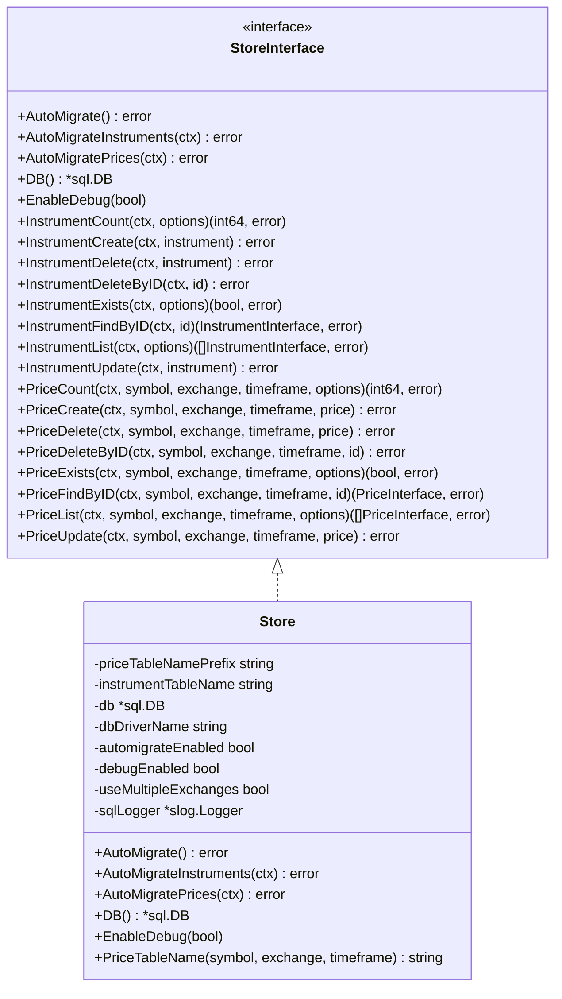
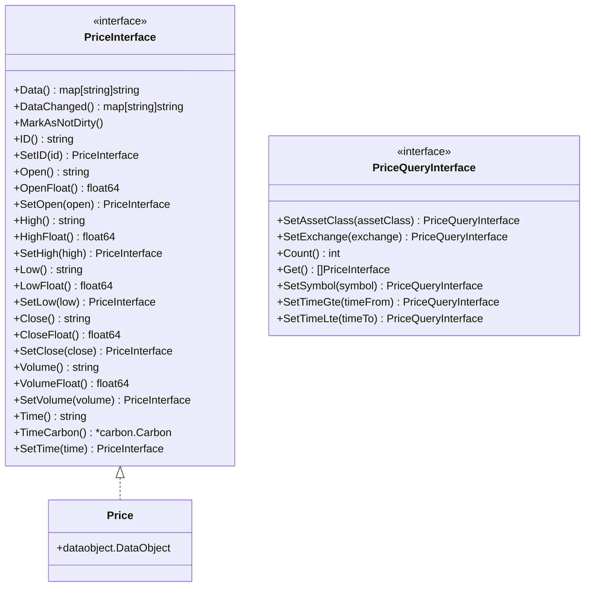
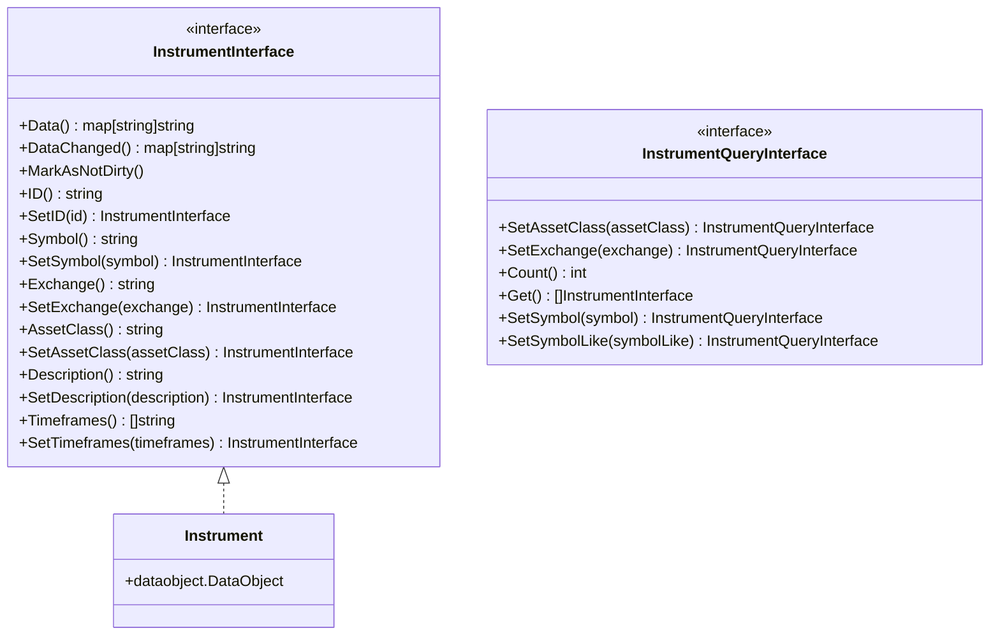

# Trading Store <a href="https://gitpod.io/#https://github.com/dracory/tradingstore" style="float:right:"></a>

[](https://github.com/dracory/tradingstore/actions/workflows/tests.yml)
[](https://goreportcard.com/report/github.com/dracory/tradingstore)
[](https://pkg.go.dev/github.com/dracory/tradingstore)

TradingStore is a Go package for storing and managing financial market data, including OHLCV (Open, High, Low, Close, Volume) price data and instrument definitions.

## Features

- Store price data with OHLCV format
- Manage financial instrument definitions (symbols, exchanges, asset classes)
- Query price and instrument data with flexible filters
- Support for different asset classes (Currency, ETF, Index, REIT, Stock)
- Supports multiple database storages (SQLite, MySQL, or PostgreSQL)
- Dynamic price table naming with pattern `price_{symbol}_{timeframe}` or `price_{symbol}_{exchange}_{timeframe}`

## Price Table Naming Convention

Price data is stored in tables following the pattern:

- `price_{lowercase(symbol)}_{lowercase(timeframe)}` (default)
- `price_{lowercase(symbol)}_{lowercase(exchange)}_{lowercase(timeframe)}` (when `UseMultipleExchanges` is enabled)

This approach allows for better data organization and improved query performance.

## Queries

TradingStore provides powerful query interfaces for retrieving price and instrument data:

### Price Queries

```go
// Get all prices for AAPL in June 2023
prices, err := store.PriceList(ctx, "AAPL", "NASDAQ", TIMEFRAME_1_MINUTE,
    NewPriceQuery().
        SetTimeGte("2023-06-01T00:00:00Z").
        SetTimeLte("2023-06-30T23:59:59Z"))

// Count prices matching criteria
count, err := store.PriceCount(ctx, "AAPL", "NASDAQ", TIMEFRAME_1_MINUTE,
    NewPriceQuery())

// Check if specific price data exists
exists, err := store.PriceExists(ctx, "AAPL", "NASDAQ", TIMEFRAME_1_MINUTE,
    NewPriceQuery().SetTime("2023-06-01T16:00:00Z"))
```

### Instrument Queries

```go
// Get all stock instruments
instruments, err := store.InstrumentList(ctx, NewInstrumentQuery().
    SetAssetClass(ASSET_CLASS_STOCK))

// Find instruments with names containing "Apple"
instruments, err := store.InstrumentList(ctx, NewInstrumentQuery().
    SetSymbolLike("Apple"))

// Count instruments on NASDAQ
count, err := store.InstrumentCount(ctx, NewInstrumentQuery().
    SetExchange("NASDAQ"))
```

## Usage Example

```go
package main

import (
    "context"
    "database/sql"
    "fmt"
    "log"

    "github.com/dracory/tradingstore"
    _ "modernc.org/sqlite"
)

func main() {
    // Open a database connection
    db, err := sql.Open("sqlite", "trading.db")
    if err != nil {
        log.Fatal(err)
    }
    defer db.Close()

    // Create a new trading store
    store, err := tradingstore.NewStore(tradingstore.NewStoreOptions{
        PriceTableNamePrefix: "price_",
        InstrumentTableName:  "instruments",
        UseMultipleExchanges: false,
        DB:                  db,
        AutomigrateEnabled:  true,
    })
    if err != nil {
        log.Fatal(err)
    }

    ctx := context.Background()

    // Create a new instrument
    instrument := NewInstrument().
        SetSymbol("AAPL").
        SetExchange("NASDAQ").
        SetAssetClass("STOCK").
        SetDescription("Apple Inc.").
        SetTimeframes([]string{TIMEFRAME_1_MINUTE, TIMEFRAME_5_MINUTES, TIMEFRAME_1_HOUR, TIMEFRAME_1_DAY})

    if err := store.InstrumentCreate(ctx, instrument); err != nil {
        log.Fatal(err)
    }

    // Create pricing tables
    err := store.AutomigratePrices()

    if err != nil {
        log.Fatal(err)
    }

    // Create a price entry
    price := NewPrice().
        SetTime("2023-06-01T16:00:00Z").
        SetOpen("180.25").
        SetHigh("182.50").
        SetLow("179.80").
        SetClose("181.75").
        SetVolume("34250000")

    if err := store.PriceCreate(ctx, "AAPL", "NASDAQ", TIMEFRAME_1_MINUTE, price); err != nil {
        log.Fatal(err)
    }

    // Query prices
    prices, err := store.PriceList(ctx, "AAPL", "NASDAQ", TIMEFRAME_1_MINUTE, NewPriceQuery().
        SetTimeGte("2023-06-01T00:00:00Z").
        SetTimeLte("2023-06-30T23:59:59Z"))
    if err != nil {
        log.Fatal(err)
    }

    for _, p := range prices {
        fmt.Printf("AAPL on %s: Open=%s, Close=%s\n",
            p.Time(), p.Open(), p.Close())
    }
}
```

## Architecture

The TradingStore library is organized into three main components:

### Store Component



### Price Component



### Instrument Component



## License

This project is licensed under the GNU Affero General Public License v3.0 (AGPL-3.0). You can find a copy of the license at [https://www.gnu.org/licenses/agpl-3.0.en.html](https://www.gnu.org/licenses/agpl-3.0.txt)

For commercial use, please use my [contact page](https://lesichkov.co.uk/contact) to obtain a commercial license.
